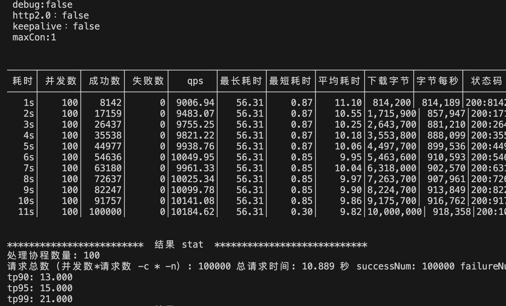
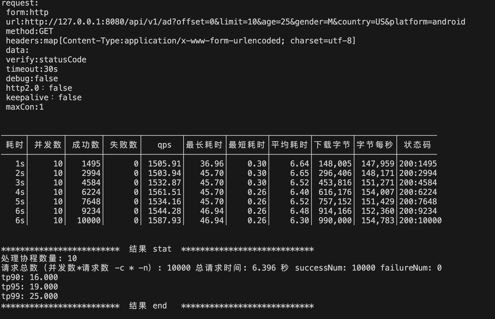

# Dcard 2024 Intern Backend Homework

## Usage

Golang(Gin, Gorm), Docker, PostgreSQL, Redis, NGINX, DevContainer

## Description

[Homework](https://drive.google.com/file/d/1dnDiBDen7FrzOAJdKZMDJg479IC77_zT/view)

[開發紀錄 - Notion](https://www.notion.so/9229affad7904f708413dc0084278e10?v=8e06f638ba244fd694a703e2eef3c113&pvs=4)

**最終成果，10000qps🥳**



### 初期想法

- 使用 DevContainer 作為開發環境
- 使用 Golang 作為後端語言
- 使用 Gin 作為 Restful API 框架
- 使用 Gorm 作為 ORM
- - 有 Django 的開發經驗，因此選擇 Gorm 幫助開發
- 使用 PostgreSQL 作為資料庫
- 使用 go-stress-testing 進行壓力測試

#### 開發流程

憑藉過往 Django 的類似開發經驗，因此選擇 MVC 架構開發
結構如下

```
.
├── internal
│   ├── model
│   ├── router
│   └── controller
└── cmd
    └── main.go
```

定義 Model 結構

- 由於選用 pgsql，因此使用 StringArray 作為資料庫欄位
- Active 欄位為了以後處理系統的總活躍度廣告數量不超過 1000

```
type Advertisement struct {
    ID        uint           `json:"id" gorm:"primary_key"`
    Title     string         `json:"title"`
    StartAt   time.Time      `json:"startAt"`
    EndAt     time.Time      `json:"endAt"`
    AgeStart  *int           `json:"ageStart,omitempty"`
    AgeEnd    *int           `json:"ageEnd,omitempty"`
    Gender    pq.StringArray `json:"gender,omitempty" gorm:"type:varchar(10)[]"`
    Country   pq.StringArray `json:"country,omitempty" gorm:"type:varchar(10)[]"`
    Platform  pq.StringArray `json:"platform,omitempty" gorm:"type:varchar(10)[]"`
    Active    bool           `json:"active" gorm:"default:true"`
}
```

驗證 API 輸入

- 由於選用 Gin，因此使用 binding 作為驗證輸入

```
type AdGetRequest struct {
    Offset   int    `form:"offset"`
    Limit    int    `form:"limit" binding:"gte=1,lte=100"`
    Age      *int    `form:"age" binding:"omitempty,gte=1,lte=100"`
    Gender   *string `form:"gender" binding:"omitempty,oneof=M F"`
    Country  *string `form:"country" binding:"omitempty,iso3166_1_alpha2"`
    Platform *string `form:"platform" binding:"omitempty,oneof=android ios web"`
}
```

#### 初級成果(1500rps)



### 後續想法

1. 為了提高效能，將 GET API 資料庫查詢結果快取至 Redis
2. 使用 NGINX 作為反向代理伺服器，以便後續擴展(最終沒用到)
3. 使用 LUA 腳本，讓 NGINX 直接處理 Redis 查詢，減少後端伺服器負擔
4. 為了方便測試，改變架構，多了 dto 和 repository 處理相關邏輯
5. HW Requirement: **同時存在系統的總活躍廣告數量 (也就是 StartAt < NOW < EndAt) < 1000**
6. HW Requirement: **每天 create 的廣告數量 不會超過 3000 個**

#### 開發流程

nginx & redis

- 為了達成第三點，使用 openresty 鏡像，並且使用 lua 腳本處理 redis 查詢 [可參考](./nginx/default.conf)
  需要注意的是，因為 openresty 鏡像的關係，無法直接設定 nginx 的 workerprocess，因此進行壓力測試時，需要進入容器內部修改 nginx.conf

```
local res, err = red:get(key)
if not res or res == ngx.null then
    local uri = string.gsub(ngx.var.uri, "/$", "")
    local resp = ngx.location.capture("/app" .. uri .. "?" .. ngx.var.args)
    if resp.status == 200 then
        local ok, err = red:setex(key, 600, resp.body)
        if not ok then
            ngx.say("Failed to set key: ", err)
            return
        end
        ngx.say(resp.body)
    else
        ngx.say("Failed to proxy to app: ", resp.status)
    end
else
    ngx.say(res)
end
```

測試

- 測試時，需要 mock db，因此添加了 interface 進行 mock
  並且為了避免互相 import，添加了 dto 存放 API 格式和把 model 操作邏輯獨立出來

同時存在系統的總活躍廣告數量 (也就是 StartAt < NOW < EndAt) < 1000

- pqsql 添加了 Trigger[可參考](./pg_sql/set_trigger.sql)，每次新增廣告時，會查看 redis 紀錄的活躍廣告數量，如果超過 1000，執行 UpdateActiveCount
- UpdateActiveCount 會將最早的廣告設為非活躍，使 Active 的資料筆數更新為 999，並且更新 redis 紀錄

每天 create 的廣告數量 不會超過 3000 個

- 在容器啟動時，設定 redis 紀錄每日新增廣告數量為 0 和過期時間為當晚 12 點
- 在 NGINX 的 lua 腳本中，添加了每日新增廣告數量的限制

```
if not res or res == ngx.null then
    local ok, err = red:setex("CreateAd", 86400, 1)
elseif res >= 3000 then
    ngx.say("Today's requests are over 3000")
    return
else
    local ok, err = red:incr("CreateAd")
end
```

## 最終成果就是 10000qps🥳


## TODO

- [ ] 完善單元測試
- [ ] 完善 CI/CD
- [ ] 完善文件(API 文件)
- [ ] 補充安裝說明
